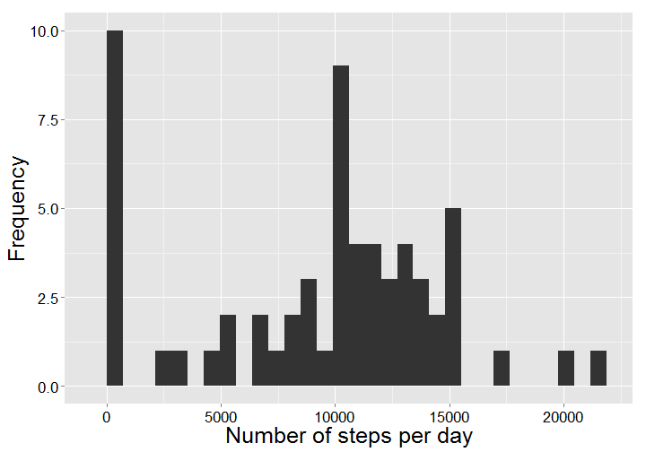

Peer Assessment 1 "Reproducible Research"
========================================================


```r
require(ggplot2)
```

```
## Loading required package: ggplot2
```

```r
require(plyr)
```

```
## Loading required package: plyr
```


```r
setwd("F:/miscellanea/R Resources and Models/Coursera/Reproducible Research")

dat <- read.csv("activity.csv")
```


```r
dat$date <- strptime(dat$date, format = "%Y-%m-%d")
dat$date.day <- format(dat$date, format = "%Y-%j")
```


```r
steps.day <- ddply(dat, .(date.day), function(df) {
  
  ds <- data.frame(
    day = unique(df$date.day)
    , steps = sum(df$steps, na.rm = TRUE)
    )
  
  return(ds)
  
  })


p <- ggplot(steps.day, aes(x=steps)) +
  geom_histogram() +
  ylab("Frequency") +
  xlab("Number of steps per day") +
  theme(axis.title.y = element_text(vjust=1, size=25, angle=90)) +
  theme(axis.title.x = element_text(size=25, angle=0)) +
  theme(axis.text.x = element_text(size=17, angle=0, colour = "black")) +
  theme(axis.text.y = element_text(size=17, colour = "black")) +
  theme(legend.text = element_text(size = 15)) +
  theme(legend.title = element_text(size = 15, face = "bold")) +
  theme(legend.background = element_blank())

p
```

 


```r
median.steps <- median(steps.day$steps, na.rm = TRUE)
mean.steps <- mean(steps.day$steps, na.rm = TRUE)

cat("The mean number of steps taken each day was ", round(mean.steps, 2), " while the median was ", round(median.steps, 2), ".", sep = "")
```

```
## The mean number of steps taken each day was 9354 while the median was 10395.
```


```r
steps.interval <- ddply(dat, .(interval), function(df) {
  
  ds <- data.frame(
    interval = unique(df$interval)
    , steps = mean(df$steps, na.rm = TRUE)
    )
  
  return(ds)
  
  })

max.index <- which.max(steps.interval$steps)

p <- ggplot(steps.interval, aes(x = interval, y = steps)) +
  geom_line(size = 1.5, colour = "steelblue") +
  geom_vline(xintercept = steps.interval$interval[max.index]) +
  theme_bw() +
  ylab("Average number of steps taken") +
  xlab("Interval") +
  theme(axis.title.y = element_text(vjust=1, size=25, angle=90)) +
  theme(axis.title.x = element_text(size=25, angle=0)) +
  theme(axis.text.x = element_text(size=17, angle=0, colour = "black")) +
  theme(axis.text.y = element_text(size=17, colour = "black")) +
  theme(legend.text = element_text(size = 15)) +
  theme(legend.title = element_text(size = 15, face = "bold")) +
  theme(legend.background = element_blank())

p
```

 

```r
cat("The interval with the most taken steps on average was ", steps.interval$interval[max.index], ".", sep = "")
```

```
## The interval with the most taken steps on average was 835.
```

The mean of the corresponding 5-minute-interval is used to impute the missing values.


```r
total.missing <- sum(is.na(dat$steps))
cat("The total number of missing values was ", total.missing, ".", sep = "")
```

```
## The total number of missing values was 2304.
```

```r
# Imputing

dat.miss <- dat[is.na(dat$steps), names(dat)[2:4]]

dat.miss <- join(x = dat.miss, y = steps.interval, by = "interval")

dat.new <- dat[!is.na(dat$steps), ]

dat.imp <- rbind(dat.new, dat.miss)

steps.day.imp <- ddply(dat.imp , .(date.day), function(df) {
  
  ds <- data.frame(
    day = unique(df$date.day)
    , steps = sum(df$steps, na.rm = TRUE)
    )
  
  return(ds)
  
  })


p <- ggplot(steps.day.imp, aes(x=steps)) +
  geom_histogram() +
  ylab("Frequency") +
  xlab("Number of steps per day (imputed)") +
  theme(axis.title.y = element_text(vjust=1, size=25, angle=90)) +
  theme(axis.title.x = element_text(size=25, angle=0)) +
  theme(axis.text.x = element_text(size=17, angle=0, colour = "black")) +
  theme(axis.text.y = element_text(size=17, colour = "black")) +
  theme(legend.text = element_text(size = 15)) +
  theme(legend.title = element_text(size = 15, face = "bold")) +
  theme(legend.background = element_blank())

p
```

 

```r
median.steps.imp <- median(steps.day.imp$steps, na.rm = TRUE)
mean.steps.imp <- mean(steps.day.imp$steps, na.rm = TRUE)

cat("The mean number of steps taken each day with imputed data was ", round(median.steps.imp, 2), " while the median was ", round(mean.steps.imp, 2), ".", sep = "")
```

```
## The mean number of steps taken each day with imputed data was 10766 while the median was 10766.
```

```r
# The median and mean are now identical. Both are higher than before.
```


```r
dat.imp <- transform(dat.imp, weekend = as.POSIXlt(date, format='%m/%d/%Y')$wday %in% c(0, 6))

dat.imp$weekend <- factor(dat.imp$weekend, labels = c("weekday", "weekend"))

dat.imp.steps.interval <- ddply(dat.imp, .(interval, weekend), function(df) {
  
  ds <- data.frame(
    interval = unique(df$interval)
    , steps = mean(df$steps, na.rm = TRUE)
    , weekend = unique(df$weekend)
    )
  
  return(ds)
  
  })

p <- ggplot(dat.imp.steps.interval, aes(x = interval, y = steps, group = weekend)) + facet_wrap(~weekend, nrow = 2) +
  geom_line(aes(colour = weekend), size = 1.5) +
  theme_bw() +
  ylab("Average number of steps taken") +
  xlab("Interval") +
  theme(axis.title.y = element_text(vjust=1, size=25, angle=90)) +
  theme(axis.title.x = element_text(size=25, angle=0)) +
  theme(axis.text.x = element_text(size=17, angle=0, colour = "black")) +
  theme(axis.text.y = element_text(size=17, colour = "black")) +
  theme(legend.text = element_text(size = 15)) +
  theme(legend.title = element_text(size = 15, face = "bold")) +
  theme(legend.background = element_blank()) +
  theme(legend.position="none")

p
```

 

